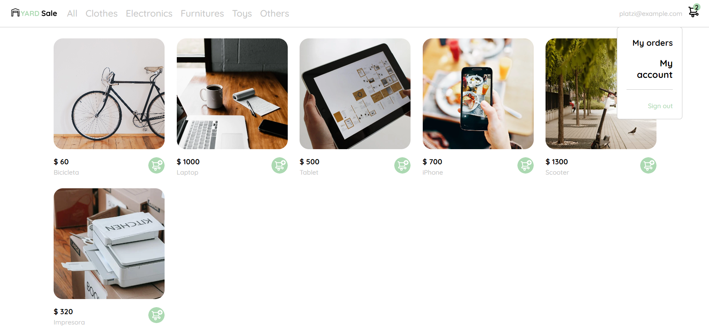

# CosmicSales - Marketplace 

## Descripción

Este repositorio es el resultado de una práctica básica del curso de JavaScript Práctico de Platzi.
 

El resultado es una maquetación con responsive design de un markeplace estático con HTML y CSS pero con 
interactividad de los componentes principales con JavaScript.

### Interacción de componentes
Al ser una práctica básica solo se programó la interacción entre ciertos componentes para poner en práctica la teoría. 
Los componentes con los que se puede interactuar son:
- Se puede desplegar el menú de la cuenta del usuario.
- Abrir y un cerrar un componente para ver más a detalle el producto.
- El carrito de compras.
- Para tamaños de dispositivos móviles se puede desplegar el menú y el carrito de compras.

### Imágenes del resultado 
Se puede acceder mediante el archivo index.html 

  
  
Vista del Marketplace para desktop

  
  
Vista del Marketplace para mobile

